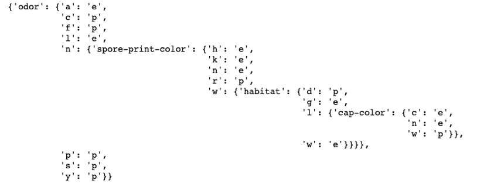

# Decision Tree algorithm from scratch in python using Jupyter notebook

This is an implementation of a full machine learning classifier based on decision trees (in python using Jupyter notebook). It uses the dataset [Mushroom Data Set](https://archive.ics.uci.edu/ml/datasets/Mushroom) to train and evaluate the classifier. This dataset come from the [UCI ML repository](https://archive.ics.uci.edu/ml/index.php). (Hint: There is missing values in this dataset, this algorithm ignores instances that have missing values.)

* It implements the Decision Tree algorithm with a train procedure. 

* It implements the information gain criterion.

* It implements tree depth control as a means of controlling the model’s complexity. In the procedure train I will implement takes a parameter stopping_depth. I will use the stopping_depth parameter to stop further splits of the tree. 

* It implements  a test procedure for the DecisionTree algorithm.

The output of this decision tree has 3 depths in general. However, this may change based on the training dataset generated by the random shuffle of instances (one guess is it due to the variance of the original dataset being too large).

While the split ratio is 0.8, in general, the root node of the decision tree is always the attribute 5 'odor', the second split is on attribute 'spore-print-color' given 'odor' = 'n', the third split is on attribute 'habitat' given 'odor' = 'n' and 'spore-print-color' = 'w', the fourth split is on attribute 'cap-color' given 'odor' = 'n', 'spore-print-color' = 'w' and 'habitat' = 'l'.

The printed decision tree is shown as below:

Setting the “stopping depth = 2”, the decision tree stops earlier compared with no stopping depth.
Setting the “stopping depth = 3”, the decision tree is the same as what we generated in the previous task.
Setting the “stopping depth = 4”, the decision tree is exactly the same while selecting the “stopping depth = 3”. The maximum depths of this decision tree is 3 in general (However, this may change based on the training dataset generated by the random shuffle of instances).

I used the testing dataset to run the test function, each instance in the test dataset will get a predicted label, then the test function gives a prediction accuracy rate as the result of the testing procedure.
If the predicted label is the same as the true label, I count it as one corrected prediction, otherwise, count as a wrong prediction. The prediction accuracy rate is the number of corrected prediction labels divided by the total number of instances in the testing dataset.

The original dataset has been split into two parts: the training dataset (80%), the testing dataset (20%). I used the training dataset to train the model, and the testing dataset to test the model. The evaluation of the model accuracy is calculated based on the testing dataset (unseen data). No cross-validation or holdout evaluation is involved in the evaluation strategy. While the split ratio is 0.8, and the “stopping depth = 3”, the prediction accuracy is 93.41%. This is a reasonably good result.
